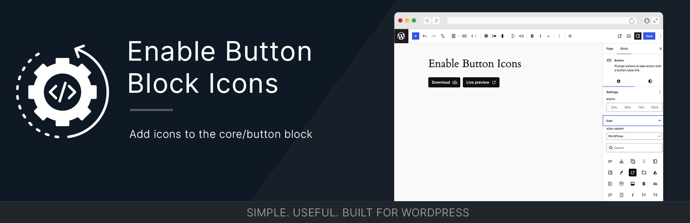

# Enable Button Icons



[](https://wordpress.org/)
[](https://www.php.net/)
[](https://github.com/bob-moore/enable-button-icons/releases/latest)
[](https://www.gnu.org/licenses/gpl-2.0.html)

[](https://github.com/bob-moore/enable-button-icons/actions/workflows/lint-css.yml)
[](https://github.com/bob-moore/enable-button-icons/actions/workflows/lint-js.yml)
[](https://github.com/bob-moore/enable-button-icons/actions/workflows/lint-php.yml)

Want to give it a test drive? Try it in the WP Playground: [](https://playground.wordpress.net/?blueprint-url=https://raw.githubusercontent.com/bob-moore/enable-button-icons/main/_playground/blueprint-github.json)

Add icons to the WordPress Button block (`core/button`) in both the editor and frontend.

## Fork Notice

This plugin is a fork and rewrite of Nick Diego's original project:
https://github.com/ndiego/enable-button-icons

This version modernizes the architecture, packaging, and update flow while keeping the plugin focused on one job: adding icons to button blocks.

## Features

- Adds icon controls to `core/button` in the block inspector.
- Supports icon libraries:
  - WordPress icons
  - MUI icons
  - Custom SVG input
- Lets you set icon position (left/right).
- Lets you set icon size per button using CSS units (for example `1em`, `20px`, `1.25rem`).
- Renders sanitized inline SVG on the frontend.
- Ships with GitHub-based plugin updates in the WordPress admin update UI.

## Requirements

- WordPress 6.9+
- PHP 8.2+

## Installation

### Install as a plugin

1. Download the latest release zip from GitHub releases.
2. In WordPress admin, go to Plugins -> Add New Plugin -> Upload Plugin.
3. Upload the zip and activate Enable Button Icons.

### Install via Composer (library usage)

If you are embedding this into your own project:

```bash
composer require bmd/enable-button-icons
```

Then bootstrap:

```php
use Bmd\EnableButtonIcons\Plugin;

$plugin = new Plugin(
    plugin_dir_url( __FILE__ ),
    plugin_dir_path( __FILE__ )
);

$plugin->mount();
```

## Usage

1. Add a Button block.
2. Open the block sidebar.
3. Open the Icon panel.
4. Choose an icon source (WordPress, MUI, or Custom SVG).
5. Pick icon size and position.
6. Save and view the post.

## Updates

This plugin is distributed through GitHub releases (not WordPress.org). The plugin includes a scoped GitHub updater so WordPress can detect and apply new versions from this repository.

## Changelog

### 0.3.2

- Refined the PHP plugin architecture around a dedicated bootstrapper, plugin service, and utility helper.
- Updated Composer autoloading for the new `Bmd\EnableButtonIcons` namespace structure.
- Added and completed PHP file comments and method documentation.
- Updated plugin banner artwork.
- Rebuilt scoped updater dependencies.
- Removed source icon packages from normal development dependencies now that icon data is generated.

### 0.3.1

- Added icon toggle deselection — clicking the currently selected icon removes it.
- Split editor sidebar into separate "Icon" and "Icon Styles" panels.
- Improved icon size control layout with a consistent label and grid alignment.
- Fixed null safety for custom SVG icon input field.
- Fixed block list rendering to skip when icon has no source.
- Updated `IconValue` TypeScript types to allow nullable fields.
- Removed unused `classnames` dependency.

### 0.3.0

- Forked and rewritten from the original `ndiego/enable-button-icons` project.
- Added service-based plugin architecture.
- Added scoped GitHub updater bootstrap.
- Added modern build and release packaging workflow.
- Added icon controls for WordPress, MUI, and custom SVG.
- Added frontend icon rendering with sanitization and per-button sizing/position.
